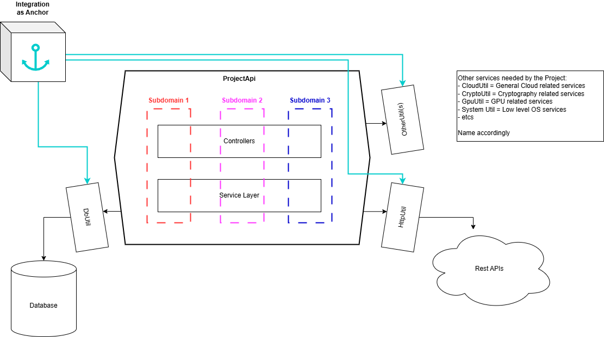

# sb322jdk21-backend

## Background

Agile Manifesto has been around for quite a while but it's mainly talking about the attitude and mindeset on how software team should think and behaves. But as a Software Engineer myself, with exposure of different codebases from different companies and industries, I noticed that different companies just pick some specific Code Architecture and Design Pattern and 1 pattern fit all towards all their projects.

Most of the time, code architectures was designed to cater for technical limitation, such as scalability issue to be dealt by Event-Driven-Architecture while sacrificing readability due to over-decoupled microservices which no longer carry the User Story of the business domain resulting in high learning curve for new team members just to pick up the business domain and extensive time needed to change all relevant services for any new features.
- Readability, Adaptability, Maintainability no longer in the picture

With the release of Virtual Thread since JDK21 to help us on the scalability, we can revisit all the historical Design Patterns researched and created throughout the Software Engineering community so far. 

This Project experiments on the possible Code Architecture with different design patterns to cater for the ever growing software complexities that business requires while fully adhering to the Agile Manifesto with the focus on these few points below:
- Simplicity
- Readability
- Adaptability
- Maintainability

## Architecture

### Code Structure

sb322jdk21 code structure is based on combination of `Hexagonal Architecture`, `Integration Design` & `Domain Driven Design`, where:
* `Hexagonal Architecture` - Separate the IO and general reusable codes into Utils
* `Integration Design` (Limited, only to be used by ProjectApi's Modules) - To anchor all the Hexagonal Architecture's module with a centralized model within the API
* `Domain Driven Design` - Separate the main modules into package/folder of its own subdomain (e.g Banking, Loan, Fraud, etcs) but still resides as a module within the API's Executable

## Running the project
- Open the project in IntelliJ
- Right click and run com.vercarus.sb322jdk21.backend.api.Sb322Jdk21BackendApplication.java
- Visit http://localhost:8080/swagger-ui/index.html to try out the demo endpoint
